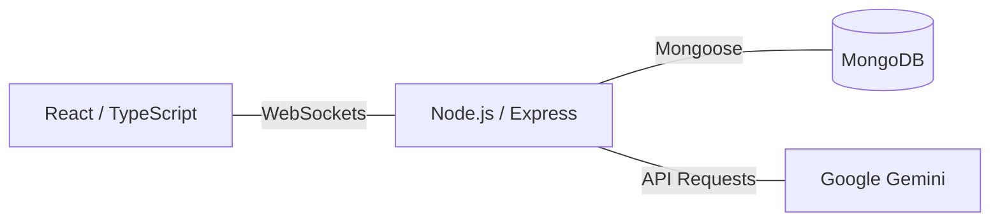

# CodeNest 🚀


**CodeNest** is a real-time collaborative code editor built using the MERN stack and Socket.io. It allows multiple users to work on the same codebase simultaneously, providing synchronized text editing, file management, and integrated AI assistance.

---

## 🛠️ Main Features

-   **Real-time Synchronization**: Concurrent editing powered by Socket.io, including live cursor positions and text selections.
-   **Data Persistence**: Automatic saving of file structures, chat messages, and drawing data to a MongoDB database.
-   **AI Coding Assistant**: Integration with the Google Gemini API to provide code suggestions and explanations within the editor.
-   **File Management**: Create, rename, delete, and organize files and directories. Support for downloading the project as a ZIP file.
-   **Collaborative Drawing**: A shared canvas for sketches and technical diagrams using Tldraw.
-   **Group Chat**: A built-in chat system for team communication.
-   **Customizable UI**: Options to change editor themes, font sizes, and languages.

---

## 🏗️ Technical Architecture



-   **Frontend**: React 18, TypeScript, Tailwind CSS, Framer Motion.
-   **Backend**: Node.js, Express.js.
-   **State & Sync**: Socket.io for real-time events.
-   **Database**: MongoDB Atlas for persistent storage.

---

## ⚙️ Setup and Installation

### 1. Project Setup
```bash
# Clone the repository
git clone https://github.com/utkarshrajput/CodeNest.git
cd CodeNest

# Install dependencies for both client and server
npm run install-all
```

### 2. Configuration
Create a `.env` file in the `client` and `server` folders. Refer to the `.env.example` files for the required keys.

**Important Keys:**
- `MONGO_URI`: Your MongoDB connection string.
- `GEMINI_API_KEY`: Your Google Gemini API key.

### 3. Execution
```bash
# Start the development server and client concurrently
npm run dev
```

---

## 🤝 Contributing

Contributions are welcome. Please open an issue or submit a pull request for any bugs or feature requests. If you find this project helpful, feel free to give it a **Star** ⭐.

### Developed by [Utkarsh Rajput](https://github.com/Utkarsh1087)
